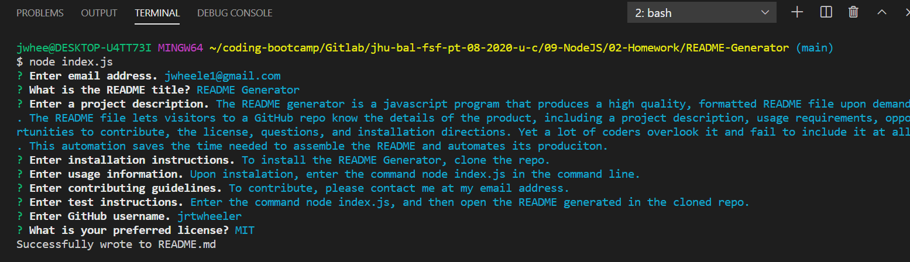

# README Generator
  
  ## Table of Contents
  * [Installation](#Installation)
  * [Description](#Description)
  * [Usage](#Usage)
  * [License](#License)
  ## Description
   The README generator is a javascript program that produces a high quality, formatted README file upon demand. The README file lets visitors to a GitHub repo know the details of the product, including a project description, usage requirements, opportunities to contribute, the license, questions, and installation directions. Yet a lot of coders overlook it and fail to include it at all. This automation saves the time needed to assemble the README and automates its production.
  
  
  ## Installation
    
  ## Usage Information
    Upon instalation, enter the command node index.js in the command line.
  ## License
  Copyright (c) Microsoft Corporation. All rights reserved.
  
  Licensed under the MIT license.
  ## Contributing Guidelines
    Answer the prompts. View a demo [here](https://drive.google.com/file/d/1yqF2Do7sPyDc9wMi5_-Mz09xYJF8bVyu/view?usp=sharing).
  ## Tests
  Enter the command node index.js, and then open the README generated in the cloned repo.
  ## Questions
  If you have any further questions, please contact me at jwheele1@gmail.com.
  My GitHub profile is [Github Repo](https://github.com/jrtwheeler).
